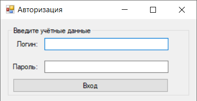

# Проект осуществляющий соединение с БД
 
### Использование
Для работы необходимо развернуть сервер и изменить имя сервера в сети в файле DBConnection DBConn.cs Примеры запросов создания базы данных есть в папке FinalVersion/SQL
После этого пользователю будет доступно окно авторизации (логины и пароль написаны в комментариях в MainParolForm.cs)
После авторизации пользователю согласно выбранной роли будет доступна работа с этой бд посредством этой программы
Программа выполняет следущий функционал - создание новых записей, редактирование, и удаление этих записей в случае попытки удаления записи вызывается окно ошибки требующее избавиться от зависимостей перед удалением
  